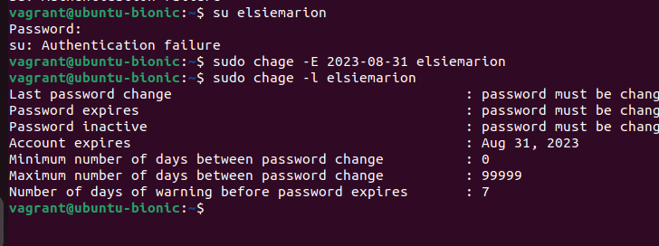
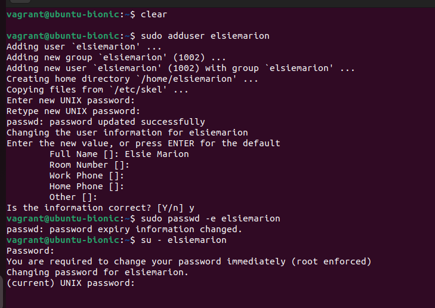
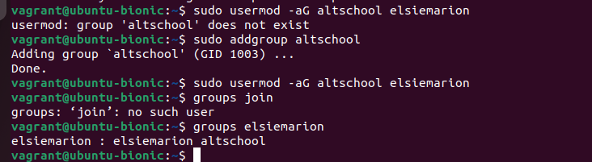

## Requirmenents:
- Virtual Machine Installed
- Vagrant installed 
- Ubuntu set up on vagrant through the vagrantfile


## Steps Done:
 1. Creating a new user
 2. Creating expiry date for this alleged user

 User for this case is elsiemarion, then the expiry date for two weeks from now would be 2023-08-31

 Command: ``` sudo useradd -e 2023-08-31 elsiemarion```

 To confirm expiry ``` sudo chage -l username```




3. Prompting user to change their password on login

After creating the user,adding a general password for this user is necessary beore they are able to get prompts to change it



4. Attach User to a group called Altschool

First, l created a group called altschool, then added the user elcymarion to that group.
To verify the group:  ``` id -gn elsiemarion```




5.  Allowing altschool group to be able to run only cat command on /etc/

Using ``` ``` which gives access  to see the various groups listed permission from the text editor

Next l edited the text editor file, to only allow altschool group to use cat command
``` ``` 


6. Creating a new user who doesn't have a a home directory

 -M is used to create a user without a home directory.

 I create a new user, adds the password for the user and verifies whether the user has a home directory or not 

 